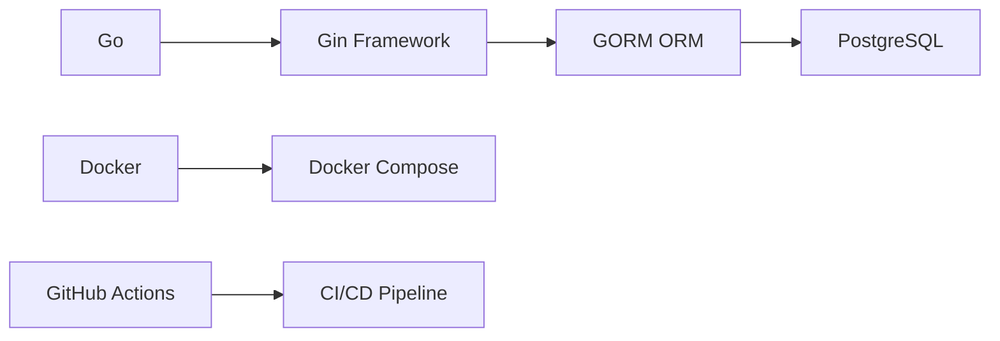

# 🎓 StudentHub-API - Go + Gin + PostgreSQL

<div align="center">


[](https://github.com/karolaynel/teste-alura)
[](https://github.com/karolaynel/teste-alura)
[](http://makeapullrequest.com)

**A complete student management API built with Go, Gin, and PostgreSQL - containerized with Docker and powered by CI/CD**

[Features](#-features) •
[Tech Stack](#-technology-stack) •
[Quick Start](#-quick-start) •
[API Reference](#-api-endpoints) •
[Testing](#-running-tests) •
[About](#-about-this-project)

</div>

---

## 📖 Overview

This project is a **RESTful API** for managing student records, built as part of an Alura course on Go development and CI/CD practices. It demonstrates modern backend development with containerization, automated testing, and continuous integration.

---

## ✨ Features

| Category | Features |
|----------|----------|
| **📊 CRUD Operations** | Create, Read, Update, Delete student records |
| **🔍 Advanced Search** | Find students by ID or CPF (Brazilian ID) |
| **✅ Data Validation** | Server-side validation for all student attributes |
| **📄 Static Pages** | HTML interface to display student data |
| **🐳 Containerization** | Fully dockerized with Docker Compose |
| **🧪 Testing** | Integration tests suite included |
| **⚙️ CI/CD** | Automated pipeline with GitHub Actions |
| **🛠️ Automation** | Makefile for common tasks |

---

## 🛠️ Technology Stack



| Layer | Technology | Purpose |
|-------|------------|---------|
| **Language** |  | High-performance backend |
| **Web Framework** |  | Fast, minimalist web framework |
| **Database** |  | Relational data persistence |
| **ORM** |  | Object-Relational Mapping |
| **Containerization** |  | Consistent development environment |
| **CI/CD** |  | Automated testing and integration |

---

## 🚀 Quick Start

### Prerequisites

- 🐳 [Docker](https://docker.com/)
- 🐙 [Docker Compose](https://docs.docker.com/compose/)

### Installation in 2 Steps

```bash
# 1. Clone the repository
git clone https://github.com/karolaynel/teste-alura.git
cd teste-alura.git

# 2. Start the services
docker compose up -d
```

🎉 **That's it!** The API will be running at `http://localhost:8080`

---

## 📋 API Endpoints

### 📌 Reference Table

| Method | Endpoint | Description | Request Body |
|:-------|:---------|:------------|:-------------|
| 🟢 GET | `/alunos` | List all students | ❌ |
| 🟢 GET | `/alunos/:id` | Get student by ID | ❌ |
| 🟢 GET | `/alunos/cpf/:cpf` | Search by CPF | ❌ |
| 🟡 POST | `/alunos` | Create new student | ✅ |
| 🟠 PATCH | `/alunos/:id` | Update student | ✅ |
| 🔴 DELETE | `/alunos/:id` | Delete student | ❌ |
| 🟢 GET | `/:nome` | Greeting endpoint | ❌ |
| 🟢 GET | `/index` | HTML student list | ❌ |
| 🔵 ANY | `/*path` | Custom 404 page | ❌ |

### 📦 Student Model

```json
{
  "nome": "Jane Doe",
  "cpf": "12345678901",
  "rg": "123456789"
}
```

### 💻 Usage Examples

#### Create a Student
```bash
curl -X POST http://localhost:8080/alunos \
  -H "Content-Type: application/json" \
  -d '{
    "nome": "John Smith",
    "cpf": "98765432101",
    "rg": "987654321"
  }'
```

#### Search by CPF
```bash
curl http://localhost:8080/alunos/cpf/12345678901
```

#### List All Students
```bash
curl http://localhost:8080/alunos
```

---

## 🧪 Running Tests

### Integration Tests

The project includes a comprehensive test suite:

```bash
# Ensure services are running
docker compose up -d

# Run tests
docker compose exec app go test -v main_test.go
```

### Test Coverage

| Test Suite | Description |
|------------|-------------|
| `TestListStudents` | Verifies GET /alunos |
| `TestCreateStudent` | Tests student creation |
| `TestGetStudentByID` | Validates ID search |
| `TestGetStudentByCPF` | Checks CPF search |
| `TestUpdateStudent` | Tests PATCH updates |
| `TestDeleteStudent` | Verifies deletion |

---

## ⚙️ Automation with Makefile

Located in `routes/` directory, the Makefile simplifies common tasks:

```bash
# Start all services
make -f routes/Makefile start

# Run test suite
make -f routes/Makefile test

# Run linter
make -f routes/Makefile lint

# Run CI pipeline locally
make -f routes/Makefile ci
```

---

## 🔄 CI/CD Pipeline

### GitHub Actions Workflow

The pipeline automatically:
- ✅ Runs on push to `main` and `branches`
- ✅ Executes on pull requests to `main`
- ✅ Sets up PostgreSQL service container
- ✅ Runs linter checks
- ✅ Executes integration tests
- ✅ Reports test coverage

---

## 📌 About This Project

<div align="center">

| 🎯 | ⚠️ | 🔄 | 📚 | 🌱 |
|---|---|---|---|---|
| **Learning Focus** | **Not Production-Ready** | **Subject to Change** | **Open to Feedback** | **Beginner-Friendly** |

</div>

> ### 🧪 **Study Project - Work in Progress**
>
> This repository was created during an **[Alura course](https://www.alura.com.br/)** on Go development and CI/CD practices. It serves as a **learning sandbox** for:
> - Building REST APIs with Gin
> - Implementing CRUD operations
> - Containerization with Docker
> - Setting up CI/CD pipelines
> - Writing integration tests

### ⚠️ Important Notes

- 🎯 **Primary Goal**: Learning and experimentation
- 🚫 **Not Intended**: For production environments
- 🔧 **Expect**: Bugs, workarounds, and learning moments
- 💡 **Welcome**: Suggestions, improvements, and feedback

### 🤝 Contributing

Found a bug? Have a suggestion? Feel free to:
- 🐛 Open an issue
- 💬 Start a discussion
- 🔧 Submit a PR

Remember: **we're all learning here!** 🌱

---

## 📊 Project Structure

```
📦 teste-alura
├── 📁 controllers/      # Request handlers
├── 📁 database/         # Database connection
├── 📁 models/          # Data models
├── 📁 routes/          # Route definitions & Makefile
├── 📁 templates/       # HTML templates
├── 🐳 docker-compose.yml
├── 🐙 Dockerfile
├── 📝 main.go
└── 🧪 main_test.go
```

<div align="center">

### ⭐ If you find this project interesting, consider giving it a star!

**Made with 💚 and lots of learning at [Alura](https://www.alura.com.br/)**

</div>
